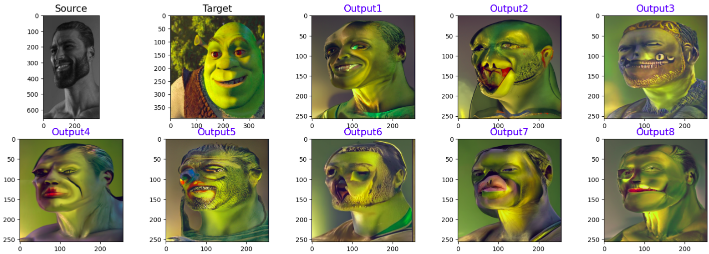
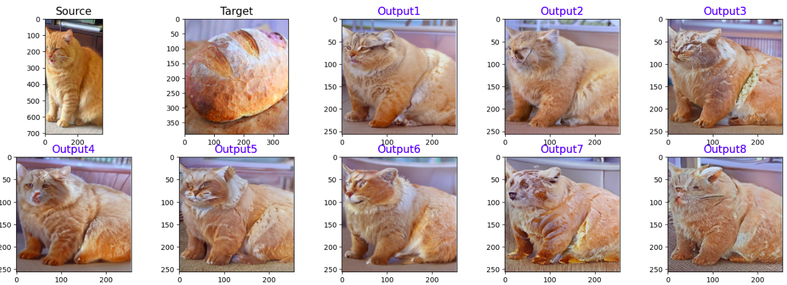
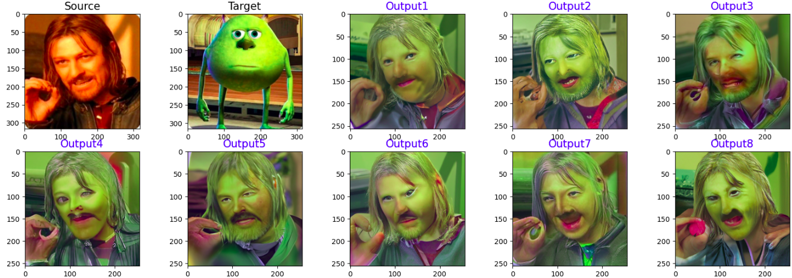

# DiffuseIT Test
## Reuse official repository of "Diffusion-based Image Translation using Disentangled Style and Content Representation" (ICLR 2023)  [LINK] : https://github.com/cyclomon/DiffuseIT

### Environment
Pytorch 1.9.0, Python 3.9

```
$ conda create --name DiffuseIT python=3.9
$ conda activate DiffuseIT
$ pip install ftfy regex matplotlib lpips kornia opencv-python torch==1.9.0+cu111 torchvision==0.10.0+cu111 -f https://download.pytorch.org/whl/torch_stable.html
$ pip install color-matcher
$ pip install git+https://github.com/openai/CLIP.git
```

### Model download
To generate images, please download the pre-trained diffusion model

imagenet 256x256 [LINK](https://drive.google.com/file/d/1kfCPMZLaAcpoIcvzTHwVVJ_qDetH-Rns/view?usp=sharing)


download the model into ```./checkpoints``` folder


### Image-guided Image translation

Quck start with Colab Demo for Image-guided Image translation [](https://colab.research.google.com/drive/1nDAJ-rxftY-_1sSX48P-on26WBRlSIAw?usp=sharing)

One iteration generate 0ne image.
```
python main.py -i "input_example/cat.png"  --output_path "./outputs/output_cat2bread" 
-tg "input_example/bread.png" --use_range_restart --diff_iter 100 --timestep_respacing 200 --skip_timesteps 80 
--use_colormatch --use_noise_aug_all --iterations_num 8
```

### Test on images







You can find tested images in dirrectory input_example and results in outputs/output_.../


### Results

This code can generate good images, but in each iteration we have different results with different quality. 
These models sometimes produce highly unrealistic outputs, particularly when generating images containing human faces. This may stem from ImageNet's emphasis on non-human objects.
In future we can train net for filtering bad examples, train diffusion model on other datasets and update algorithm for get nessesary results.

